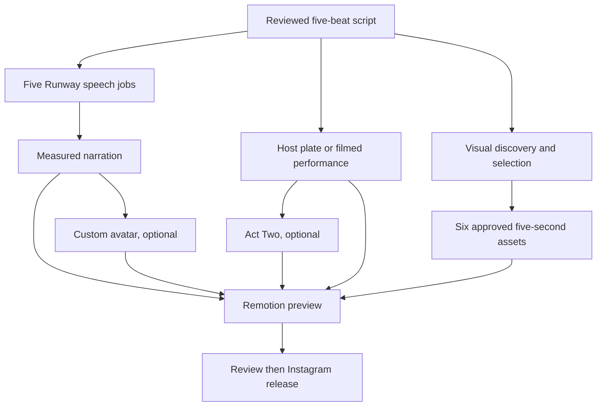

# Satoshi episode: executable production contract

## Output and production graph

The deliverable is a **30-second, 1080 × 1920 Instagram Reel**. Satoshi is the
main host image. A framed, credited corner window shows six short, muted visual
receipts. The receipts follow the script, including its limits, rather than
being a generic popularity montage. The final MP4 stays a private preview until
an editor approves a separate publication manifest.



**Parallel boundary:** after script review, the five speech requests, sourcing,
and a host plate or Act Two performance can proceed independently. A custom
talking avatar depends on the assembled narration. The render depends on the
selected host, five audio beats, and six approved visual assets. Providers do
not share a master generation job; each output can be replaced independently.

## Private episode directory

`episode.py` operates on a directory outside Git. Its files are the manifest:

| Path | Producer and contract |
| --- | --- |
| `storyboard.json` | `pipeline.py storyboard`: `awaiting_footage`, reviewed script hash, ordered five cues, spoken text and claim IDs. |
| `footage-plan.json` | `pipeline.py plan`: same script hash; six reviewed shots with cue IDs, relative media paths, 5-second trims, source credits and rights basis. |
| `clips/*` | Creator-supplied or otherwise cleared source files; originals never committed. |
| `audio/{beat}.wav` or `.mp3` | Your recordings or collected Runway speech for all five beats. |
| `plate.mp4` | A 30-second host video, or a shorter explicitly looped plate. `generated/host.mp4` from Runway can fill this slot. |
| `plate-options.json` | Optional `{"start_seconds": 0, "loop": true}`. |
| `generated/runway/*.json` | Persistent paid-job reservations and task IDs; preserve across sessions and devices. |

The existing `pipeline.py` creates storyboard and footage plan from reviewed
inputs. It accepts Instagram hashtag leads via `--instagram-catalog`, but the
approved media bytes and rights basis must be supplied separately. A search
ranking measures a whole post; a five-second attention peak requires
creator-supplied retention data. Source credit and a defensible license grant
are required even when the inset is small, cropped or accelerated.

## Run from this workspace

Install Python 3.10+, FFmpeg and Node; run `npm ci` in `remotion/` once.
`pip install -r requirements-runway.txt` is only needed for live Runway calls.
The example source assets below are private paths, never pushed to GitHub.

```sh
python3 episode.py status --input-dir /private/episode-001
python3 episode.py submit-audio --input-dir /private/episode-001 --voice-id VOICE_ID
python3 episode.py submit-audio --input-dir /private/episode-001 --voice-id VOICE_ID --live
python3 episode.py collect-audio --input-dir /private/episode-001 --voice-id VOICE_ID
python3 episode.py submit-host --input-dir /private/episode-001 --mode avatar --avatar-id AVATAR_ID --live
python3 episode.py collect-host --input-dir /private/episode-001 --record generated/runway/HASH.json
python3 episode.py render --input-dir /private/episode-001 --render-video
```

The first `submit-audio` is a **no-charge dry run**. The live command fans out
up to five speech requests; `--workers 1` makes them sequential. A recorded
beat is reused. A job with an existing ledger record is never submitted again.
If a submission fails ambiguously, inspect that record and the Runway account
before any deliberate retry. Collection can be rerun to poll pending jobs.
`RUNWAY_LIVE_ENABLED=true` and a private `RUNWAYML_API_SECRET` are needed for
live submission and collection. Provider cost and model availability must be
checked in the account before enabling the live gate.

For Act Two, replace `--mode avatar --avatar-id ...` with
`--mode act_two --character character.mp4 --performance performance.mp4`.
Act Two can be submitted while speech runs; it requires a filmed 3–30-second
performance. To bypass Runway entirely, supply five audio files and `plate.mp4`
then run `render`. `episode.py` packages trimmed silent clips, narration,
captions and host into the existing Remotion composition. It does not publish.

The repository's **Offline Reel integration fixture** GitHub Action can be run
from the GitHub Actions tab or invoked through a connected GitHub workflow
control. It returns a clearly marked synthetic MP4 artifact. It does not have
the private source assets or a durable paid-job ledger for a real episode.
For real content, run the CLI in a trusted workspace with private storage and
then return the reviewed MP4 as an artifact. Do not put footage, tokens, health
records, or reusable media in this public repo.

## Remaining production decisions

1. **Writing handoff:** draft PR #5's `source_urls` script is a discovery draft;
   the merged storyboard expects reviewed `claim_ids`. A reviewer must map
   cited URLs to checked claims and lock the script hash before media jobs.
2. **Footage supply:** no public Instagram API yields arbitrary creator Reel
   files or their best five seconds. The system takes approved creator files,
   reviewed direct sources, or separately generated visuals. It records why
   each interval was chosen; absent owner retention samples the interval is
   editor selected.
3. **Runway generated evidence:** `runway_media.py` supports speech, avatar and
   Act Two. An episode-specific video generation adapter with a stable model
   contract and paid call budget is still needed to generate replacement
   visual assets. Such assets must be labeled as illustrations, not evidence.
4. **Quality and release:** inspect the talking face, visual accuracy, caption
   sync, corner readability, rights, medical claims and sound mix in the actual
   render. `instagram.py` requires a separately approved release manifest and
   reachable hosted video URL; hosting and an automated review dashboard are
   still outstanding. Own-Reel insights and `experiment.py` can compare later
   episodes at comparable ages; that is observational feedback.

The acceptance test for a real episode is a private MP4 with the approved
host, five measured narration beats, six cue-matched visual shots and visible
credits. The offline fixture proves the mechanical assembly only.
