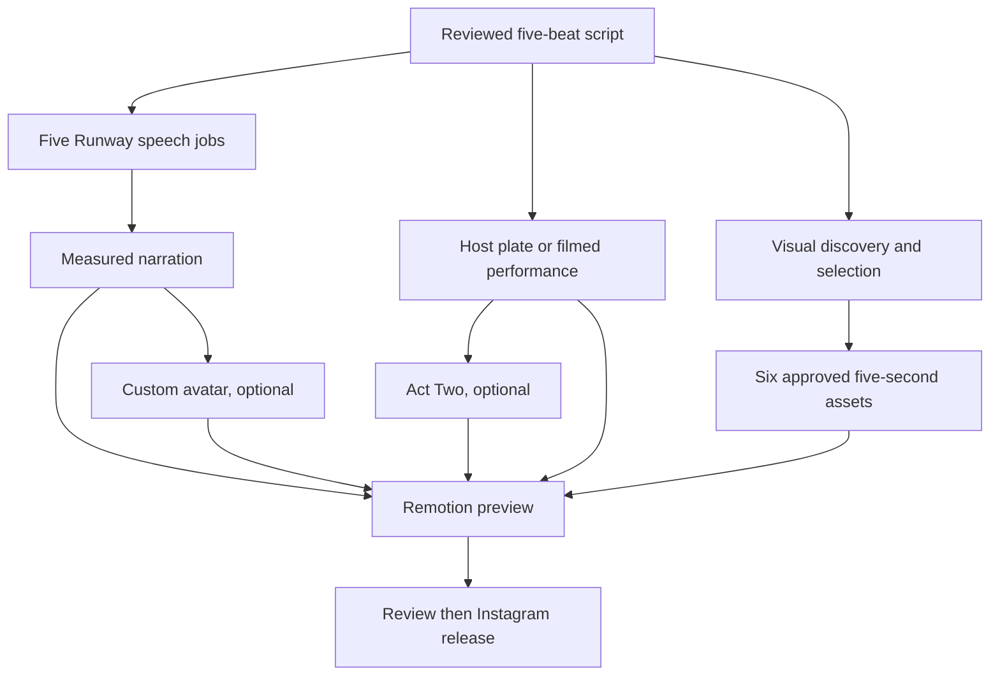

# Satoshi episode: executable production contract

## Output and production graph

The deliverable is a **30-second, 1080 × 1920 Instagram Reel**. Satoshi is the
main host image. A framed, credited corner window shows six short, muted visual
receipts. The receipts follow the script, including its limits, rather than
being a generic popularity montage. The final MP4 stays a private preview until
an editor approves a separate publication manifest.
The format is defined by the original template below. A television frame that
inspired the layout is catalogued as an optional example in
[`references/last-week-tonight-doping.json`](references/last-week-tonight-doping.json).
No script, asset or render command reads that reference record.



**Parallel boundary:** after script review, the five speech requests, sourcing,
five-second Runway visual illustrations, and a host plate or Act Two performance
can proceed independently, **before the footage plan is complete**. A custom
talking avatar depends on the assembled narration. The render depends on the
selected host, five audio beats, and six approved visual assets. Providers do
not share a master generation job; each output can be replaced independently.

## Private episode directory

`episode.py` operates on a directory outside Git. Its files are the manifest:

| Path | Producer and contract |
| --- | --- |
| `storyboard.json` | `pipeline.py storyboard`: `awaiting_footage`, reviewed script hash, ordered five cues, spoken text and claim IDs. |
| `footage-plan.json` | `pipeline.py plan`: same script hash; six reviewed shots with cue IDs, relative media paths, 5-second trims, source credits and rights basis. |
| `clips/*` | Creator-supplied or otherwise cleared source files; originals never committed. |
| `audio/{beat}.wav` or `.mp3` | Your recordings or collected Runway speech for all five beats. |
| `plate.mp4` | A 30-second host video, or a shorter explicitly looped plate. `generated/host.mp4` from Runway can fill this slot. |
| `plate-options.json` | Optional `{"start_seconds": 0, "loop": true}`. |
| `graphics.json` | Optional approved lower-third headline, e.g. `{"headline":"A TESTOSTERONE TEST WITH A CATCH"}` (55 characters maximum). |
| `generated/runway/*.json` | Persistent paid-job reservations and task IDs; preserve across sessions and devices. |

The existing `pipeline.py` creates a footage plan from reviewed inputs. For a
new topic, `produce.py` can draft a five-beat script while using web search;
`web_handoff.py` converts it into the existing storyboard only after an editor
maps every beat to separately checked claim IDs and pins both input hashes:

```sh
python3 produce.py --format short --from-hypotheses
# A configured, budgeted live call writes outputs/produce/REQUEST_ID/draft.json.
python3 produce.py --format short --from-hypotheses --live \
  --budget-usd BUDGET --max-usd-per-run RESERVATION
python3 web_handoff.py template --draft /private/draft.json \
  --case /private/reviewed-case.json --output /private/review.json
# Check the source excerpts and each spoken claim; fill review.json with the
# supporting claim IDs, editor name, and status approved.
python3 web_handoff.py approve --draft /private/draft.json \
  --case /private/reviewed-case.json --review /private/review.json \
  --output /private/episode-001/storyboard.json
```

The review is an explicit editorial judgment; matching URLs to claim records
does not prove that the narration follows from the cited studies. The
reviewed case must contain verified claims with locator, excerpt, limitations
and processing rights. `pipeline.py discover` then accepts Instagram hashtag
leads via `--instagram-catalog`, but the
approved media bytes and rights basis must be supplied separately. A search
ranking measures a whole post; a five-second attention peak requires
creator-supplied retention data. Source credit and a defensible license grant
are required even when the inset is small, cropped or accelerated.
The original vertical layout puts Satoshi in the foreground, a cue-matched
evidence window in the **upper left**, an episode headline in the lower third,
and captions below the headline. The host plate should leave the evidence
region clear. The layout is generated from the approved episode inputs, not
from any particular television episode or its imagery.

## Run from this workspace

Install Python 3.10+, FFmpeg and Node; run `npm ci` in `remotion/` once.
`pip install -r requirements-runway.txt` is only needed for live Runway calls.
The example source assets below are private paths, never pushed to GitHub.

```sh
python3 episode.py status --input-dir /private/episode-001
python3 episode.py submit-audio --input-dir /private/episode-001 --voice-id VOICE_ID
python3 episode.py submit-audio --input-dir /private/episode-001 --voice-id VOICE_ID --live
python3 episode.py collect-audio --input-dir /private/episode-001 --voice-id VOICE_ID
python3 episode.py submit-visual --input-dir /private/episode-001 \
  --cue evidence --prompt 'An abstract animated assay diagram; no real patient or result' --live
python3 episode.py collect-visual --input-dir /private/episode-001 \
  --record generated/runway/VISUAL_HASH.json
python3 episode.py submit-host --input-dir /private/episode-001 --mode avatar --avatar-id AVATAR_ID --live
python3 episode.py collect-host --input-dir /private/episode-001 --record generated/runway/HASH.json
python3 episode.py render --input-dir /private/episode-001 --render-video
```

The first `submit-audio` is a **no-charge dry run**. The live command fans out
up to five speech requests; `--workers 1` makes them sequential. A recorded
beat is reused. A job with an existing ledger record is never submitted again.
If a submission fails ambiguously, inspect that record and the Runway account
before any deliberate retry. Collection can be rerun to poll pending jobs.
`submit-visual` is also dry by default. Its collected MP4 and candidate JSON
remain `review_required`. A reviewer may select that file in the six-shot
footage plan with `visual_type: illustration`; Remotion displays
**ILLUSTRATION** over the inset. Runway generation is useful for anatomy
diagrams and conceptual transitions; it does not document a patient's injury,
a study result, or a real device demonstration. This adapter uses Runway's
[documented Gen-4.5 text-to-video route](https://docs.dev.runwayml.com/guides/using-the-api/)
at five seconds and 1280 × 720; verify account access and credits before paid use.
The collected JSON is directly accepted as another discovery lead:

```sh
python3 pipeline.py discover --storyboard /private/episode-001/storyboard.json \
  --visual-catalog /private/episode-001/generated/visual-evidence-HASH.json \
  --output /private/episode-001/catalog.json
```

The editor still supplies explicit shot approvals and a local file path to
`pipeline.py plan`; collecting the generation does not confer approval.
Write `approvals.json` as `{"approvals": [...]}` with exactly six entries,
covering all five cue IDs. Each entry needs `candidate_id` from `catalog.json`,
`cue_id`, `rights_status: "approved"`, `license_basis`, `credit`, a local
`media_source` inside the episode directory, and either `start_seconds` or
owner supplied `retention_samples`. For a generated shot set
`visual_type: "illustration"`. Then produce the private plan:

```sh
python3 pipeline.py plan --storyboard /private/episode-001/storyboard.json \
  --catalog /private/episode-001/catalog.json \
  --approvals /private/episode-001/approvals.json \
  --media-root /private/episode-001 \
  --output /private/episode-001/footage-plan.json
```

`--media-root` verifies all selected media files are in the private episode
directory and writes relative paths for `episode.py render`.
`RUNWAY_LIVE_ENABLED=true` and a private `RUNWAYML_API_SECRET` are needed for
live submission and collection. Provider cost and model availability must be
checked in the account before enabling the live gate.

For Act Two, replace `--mode avatar --avatar-id ...` with
`--mode act_two --character character.mp4 --performance performance.mp4`.
Act Two can be submitted while speech runs; it requires a filmed 3–30-second
performance. To bypass Runway entirely, supply five audio files and `plate.mp4`
then run `render`. `episode.py` packages trimmed silent clips, narration,
captions and host into the existing Remotion composition. It does not publish.

The repository's **Offline Reel integration fixture** GitHub Action can be run
from the GitHub Actions tab or invoked through a connected GitHub workflow
control. It returns a clearly marked synthetic MP4 artifact. It does not have
the private source assets or a durable paid-job ledger for a real episode.
For real content, run the CLI in a trusted workspace with private storage and
then return the reviewed MP4 as an artifact. Do not put footage, tokens, health
records, or reusable media in this public repo.

## Remaining production decisions

1. **Footage supply:** no public Instagram API yields arbitrary creator Reel
   files or their best five seconds. The system takes approved creator files,
   reviewed direct sources, or separately generated visuals. It records why
   each interval was chosen; absent owner retention samples the interval is
   editor selected.
2. **Generated visual quality:** Runway five-second illustrations can be
   requested, collected and labeled, but no paid provider smoke test or
   automatic accuracy review has been performed. Generations may fail or
   misrepresent anatomy and must be inspected before approval.
3. **Quality and release:** inspect the talking face, visual accuracy, caption
   sync, corner readability, rights, medical claims and sound mix in the actual
   render. `instagram.py` requires a separately approved release manifest and
   reachable hosted video URL; hosting and an automated review dashboard are
   still outstanding. Own-Reel insights and `experiment.py` can compare later
   episodes at comparable ages; that is observational feedback.

The acceptance test for a real episode is a private MP4 with the approved
host, five measured narration beats, six cue-matched visual shots and visible
credits. The offline fixture proves the mechanical assembly only.
