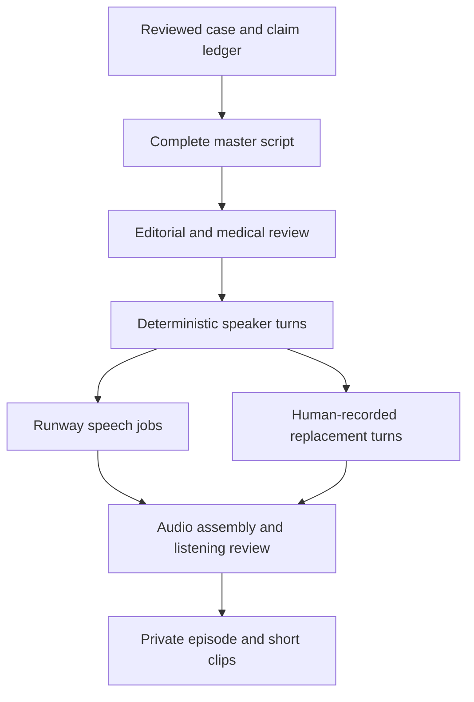

# Satoshi Shkreli: science-backed drama podcast specification

Status: **specification only**. This document describes the proposed tool; it
does not assert that the repository can currently produce this podcast.

## Editorial product

One investigated men's-health topic produces an original 6–10 minute *pilot*
conversation between two or three fictional personas. This duration is a test
range, not a claimed engagement optimum. The story asks a concrete question,
follows what happened, presents competing explanations, examines primary
evidence, distinguishes what is established from what is alleged, and ends with
the practical consequence or a next test. The 30-second Reel and podcast share
the reviewed case and claim IDs, but each has its own script and editorial
approval. The podcast should never pad the Reel or imply a synthetic exchange
is a recorded interview. **The format is science-backed drama**: curiosity and
conflicting stakes give the episode its tension. A conspiracy or coordinated
scheme can be the subject when records support that characterization; it is
never the premise required of every episode.

| Persona | Function | Boundary |
| --- | --- | --- |
| Satoshi Shkreli | Host: stakes, questions, original skeptical humor, transitions. | Asks what the evidence permits; describes documented coordination precisely. |
| Vale | Evidence analyst: methods, strongest contrary evidence, limits. | Fictional character; no invented medical credentials or personal research. |
| Morgan (optional) | Curious producer: translates jargon, presses for listener relevance. | No fabricated reporting, interviews, or first-hand experience. |

Start with Satoshi and Vale. Add Morgan only when the third voice advances the
story; a third voice by itself is not evidence of greater engagement. Public
metadata should identify the speakers as AI-voiced fictional characters where
applicable. Guest interviews, if ever added, are separately recorded and
licensed assets with actual guest consent.

## The script is the master

The writing model first composes the **entire, self-contained episode** as a
single reviewed master script. It includes exact spoken text, explicit speaker
labels, act headings, claim IDs and optional nonspoken audio direction. The
parser then splits that *approved* script deterministically into ordered turns.
It must not ask a model to invent extra dialogue during parsing. If the draft
arrives without speaker labels, a separate casting proposal may assign voices,
but it must return for human review before generation. Changing an approved
line creates a new script revision.

Suggested six-act arc (timings are pilot targets):

| Act | Job | Example on an AndroGel litigation investigation |
| --- | --- | --- |
| Hook | A consequential question in the first moments. | “What if a lawsuit held a cheaper medicine off the shelf?” |
| Scene | Establish the people, product, and date. | Identify the drug, company, and competing generic. |
| Competing accounts | Ask what else explains the event. | Ordinary patent enforcement versus sham litigation. |
| Evidence | Read the actual finding and a challenge. | Distinguish affirmed liability from withdrawn claims. |
| Limits | Narrow exactly what the record supports. | No blanket claim about every prescription or any patient's injury. |
| Payoff | Answer the opening question and name the open one. | Explain the market effect and what cannot be determined. |

Audio storytelling guidance from Transom favors a sequence of events with
context inserted when it clarifies the story. Spotify's creator guidance says
to inspect early drop-offs and compare episodes with similar themes and length
before attributing engagement to an edit. These are editorial patterns to
test, not promises of virality. [Transom: structure interviews](https://transom.org/2024/structure-interviews-like-a-good-story/)
and [Spotify: episode performance](https://creators.spotify.com/resources/grow/understanding-your-episode-performance).

## Contracts and workflow



Proposed commands and files (these commands **do not exist yet**):

| Stage | Input → artifact | Hard requirement |
| --- | --- | --- |
| `podcast write` | Reviewed case → `master-script.md`, `claims.json` | Every factual passage carries claim IDs and source locators; reviewer can see the complete episode before any voice charge. |
| `podcast approve` | Edited script → signed `approved-script.json` | Review content, cast, sponsor copy, context, and medical claims. Store a content hash and reviewer. |
| `podcast parse` | Approved script → `turns.json` | No content rewriting; turn order, speaker, exact text, claim IDs and punctuation preserved. |
| `podcast voices --dry-run` | Turns + private voice map → jobs and cost estimate | Validate access, limits, selected voices and available credits. |
| `podcast voices --live` | Approved turns → durable task ledger + WAV/MP3 per turn or scene | Bounded concurrency, job cap, retries only after provider reconciliation; reuse unchanged audio by text/voice/model hash. |
| `podcast assemble` | Audio + script order → private master, transcript, chapters | Normalize levels, breaths and pauses by listening; preserve deliberate overlap; reject missing/incorrect turns. |
| `podcast qa` | Private master → approval record | Listen end to end; check factual wording, names, pronunciation, voice continuity, ads and music licenses. |
| `podcast clips` | Approved master → short audio/video candidates | Transcript timestamps identify moments; an editor selects clips whose hooks faithfully represent the full episode. |

Example intermediate turn (the structure, not a claim that these words were
approved):

```json
{
  "act": "evidence",
  "turn_id": "evidence-07",
  "speaker_id": "vale",
  "text": "The appeals court affirmed the sham-litigation finding, but that does not answer every question about prescriptions.",
  "claim_ids": ["C-LITIGATION-01"],
  "delivery": "matter-of-fact",
  "script_revision": "SHA256_OF_APPROVED_MASTER"
}
```

The case packet and speaker registry live under version control when public.
Reviewed source excerpts, approval signatures, voice IDs, full scripts, paid-job
ledgers and generated audio live in the existing **private episode storage**.
Save a text-only release record with source URLs, claim IDs, version hashes,
runtime, license references and publication identifiers. Treat the story and
media branches as independent jobs keyed to the same case revision so neither
must wait for the other's renders.

The writer's claim ledger must mark **finding**, **allegation**, **inference**,
and **unanswered question** separately. It must also retain the actor, action,
date and source for any suggested coordination or concealment. A proven scheme
may be described plainly; an unproven one can be examined as a hypothesis only
when the episode identifies the observable evidence that would distinguish it
from other explanations. This gives Satoshi room to pursue a difficult question
without turning uncertainty into a theatrical accusation.

## Voice engine: what Runway actually supplies

Runway Dev currently lists `eleven_multilingual_v2` and `eleven_v3` as
text-to-audio models. Its published pricing is **one credit per 50 input
characters** for each, with a one-credit minimum for `eleven_v3`; developer
credits are listed at $0.01 each. A 9,000-character script therefore starts
around 180 credits, or **$1.80 for one generation pass**, before character
minimums, alternate takes, music, processing or other provider charges. This
is a planning estimate, not a quoted production price.
[Runway models](https://docs.dev.runwayml.com/guides/models/) ·
[Runway pricing](https://docs.dev.runwayml.com/guides/pricing/).

The existing `runway_media.py` uses Runway's `eleven_multilingual_v2` API for
single-voice short-form beats. For a podcast, start with **scene-sized or
turn-sized Runway speech jobs per assigned voice**, fetch the audio and assemble
locally with FFmpeg. Speech jobs across speakers may run concurrently; the
ordered script remains the source of truth. Review cadence and pauses by ear:
mechanically inserting the same pause after every line makes a conversation
sound like three machines waiting their turn. Generate two or more candidate
takes for selected pivotal scenes, not the entire episode by default.

Important distinction: ElevenLabs documents a separate **Text to Dialogue**
API on Eleven v3 that accepts multiple voice-tagged turns in a chunk and
recommends at most about **2,000 characters per request** for reliability.
It is **not established** that Runway exposes that same multi-speaker dialogue
endpoint merely because Runway lists `eleven_v3` for audio generation. The
architecture should support a replaceable direct ElevenLabs dialogue adapter
only if its separate API access and commercial terms are configured; otherwise
use the verified Runway single-speaker path. [ElevenLabs Text to Dialogue](https://elevenlabs.io/docs/overview/capabilities/text-to-dialogue).

## Engagement and measurement

Open each pilot with an actual case question, bring a specific document or
finding into the dialogue early, and use the second speaker to challenge an
easy inference. Short promotional clips should keep the episode's conclusion
intact. Spotify describes hooks and story arcs for promotional clips but does
not supply a universal winning clip length. [Spotify clip examples](https://creators.spotify.com/resources/grow/spotify-clips-drive-discovery).

Track starts, first-minute retention, median/average consumption, act-level
drop-off, completion, follows per listener and clip-to-episode visits. Compare
topics and two- versus three-speaker formats at matched age since release.
Spotify offers episode audience-retention analytics; Apple reports average
consumption from aggregated listening data. The choice of cast should be
revisited after actual audience behavior, not assumed from genre intuition.
[Spotify retention](https://creators.spotify.com/resources/grow/understanding-your-episode-performance) ·
[Apple Podcasts analytics](https://podcasters.apple.com/support/5392-listener-analytics).

## Acceptance criteria

1. A reviewed case generates one complete readable master script and a
   claim-to-line trace; an empty/unverified case blocks paid generation.
2. Parsing approved text preserves every spoken word and yields only registered
   speaker IDs; each factual assertion has reviewed source support.
3. Dry-run gives a voice and cost plan without provider charges. Repeated live
   submission does not double-charge after ambiguous timeouts.
4. Audio assets can be regenerated for one changed turn without regenerating
   the whole episode; old audio cannot silently occupy a revised turn.
5. The private MP3/WAV passes an end-to-end listening review; transcript,
   chapters and clip provenance point to the same approved script revision.
6. No feed or social platform receives an episode until a distinct publication
   approval. A synthetic fictional panel is never presented as a real interview.
